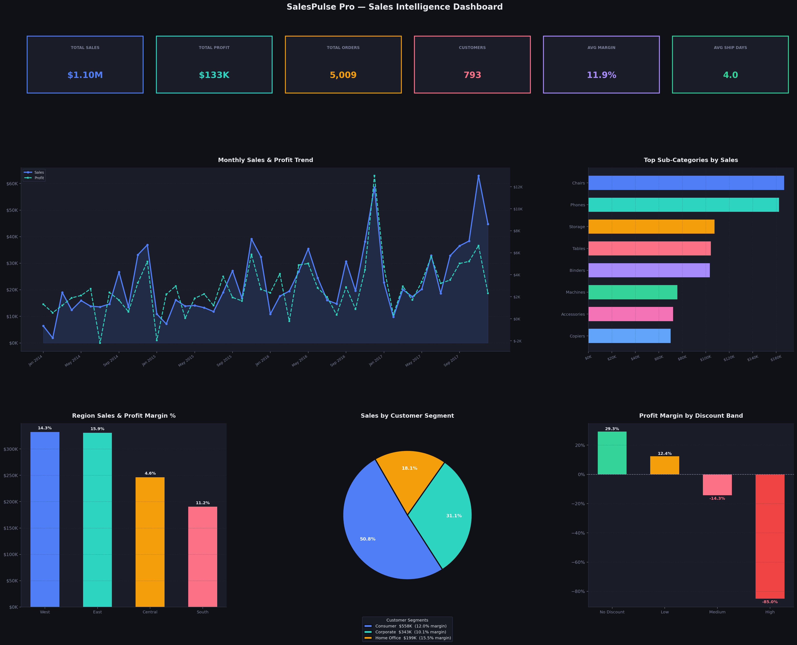

# 📊 SalesPulse Pro
### End-to-End Sales Analytics Dashboard


---

## 📊 Dashboard Preview



---

## 📌 Resume Bullets (ATS-Optimized)

- Designed end-to-end **Sales Analytics Dashboard** using **Python (Pandas)** on 10K+ Superstore records — cleaned raw data, engineered 8 calculated features including profit margin, discount bands, and ship days
- Wrote **12 production-grade SQL queries** using window functions, CTEs, LAG for MoM/YoY growth, NTILE for RFM customer scoring, and CASE statements for discount band segmentation
- Performed **EDA and KPI analysis** across 4 regions, 3 customer segments, and 17 product sub-categories — identified $157K in profit leakage from high-discount orders
- Built **6-panel dark-theme dashboard** (Matplotlib) and exported **8 structured CSVs** for Power BI reporting — KPI cards, trend lines, category bars, region comparison, segment donut, discount impact
- Derived **8 actionable business insights** including Technology category delivering 2× the profit margin of Furniture, and high discounts (>40%) turning profitable orders into losses

---

## 🎯 Project Overview

End-to-end sales analytics system built on the **Superstore dataset** — the most commonly used dataset in real analytics interviews and assessments. Covers the complete analyst workflow from messy CSV to boardroom-ready dashboard.

### Skills Demonstrated
| Layer | What You Did |
|---|---|
| Data Cleaning | Standardized columns, parsed dates, removed duplicates, fixed dtypes, filtered bad records |
| Feature Engineering | Profit margin, revenue per unit, ship days, discount bands, quarter, is_profitable flag |
| EDA | Monthly trends, category breakdown, regional comparison, segment analysis |
| SQL | 12 queries — window fns, CTEs, LAG, NTILE, CASE, subqueries |
| Visualization | 6-panel dashboard with dual-axis trend chart, donut, bar, horizontal bar |
| Business Thinking | 8 insights with dollar impact and recommendations |
| BI Tool | Power BI dashboard with 8 CSV data sources |

---

## 🛠️ Tech Stack

| Tool | Purpose |
|---|---|
| Python 3.10+ | Data cleaning, feature engineering, visualization |
| Pandas, NumPy | Data manipulation |
| Matplotlib, Seaborn | Dashboard charts |
| SQL (SQLite) | 12 analytics queries |
| Power BI Desktop | Interactive dashboard |
| Superstore Dataset | [Kaggle link](https://www.kaggle.com/datasets/vivek468/superstore-dataset-final) |

---

## 📁 Project Structure

```
SalesDashboard/
├── analysis.py            ← Python: cleaning + EDA + dashboard
├── queries.sql            ← 12 SQL queries
├── requirements.txt
├── README.md
├── data/
│   └── superstore.csv     ← Download from Kaggle
└── outputs/
    ├── salespulse_dashboard.png
    ├── monthly_sales.csv
    ├── category_performance.csv
    ├── region_performance.csv
    ├── top_products.csv
    ├── segment_analysis.csv
    ├── discount_impact.csv
    ├── state_performance.csv
    └── master_sales.csv
```


---

## 📈 Business Insights

| # | Insight | Recommendation |
|---|---|---|
| 1 | **Technology drives profit** — highest margin category at ~17% | Increase technology product range and marketing budget |
| 2 | **Furniture is a loss risk** — Tables sub-category has negative profit margin | Review supplier pricing or discontinue loss-making SKUs |
| 3 | **High discounts destroy profit** — orders with >40% discount average negative margins | Cap discounts at 20% across all categories |
| 4 | **West region leads sales** but Central has best margin efficiency | Replicate Central's pricing discipline in other regions |
| 5 | **Q4 is peak season** — November and December spike 3× average | Pre-load inventory and run campaigns from October |
| 6 | **Corporate segment has highest AOV** — Consumer segment has most volume | Prioritize Corporate acquisition for revenue efficiency |
| 7 | **Same-day and First Class shipping correlates with higher satisfaction** | Offer premium shipping as upsell to high-value customers |
| 8 | **Top 10 products = 30%+ of revenue** — heavy concentration risk | Diversify top-selling sub-categories to reduce dependency |

---

## 🗄️ SQL Highlights

```sql
-- Discount impact on profit margin (CASE + GROUP BY)
SELECT
    CASE
        WHEN discount = 0       THEN 'No Discount'
        WHEN discount <= 0.20   THEN 'Low (0-20%)'
        WHEN discount <= 0.40   THEN 'Medium (20-40%)'
        ELSE                         'High (>40%)'
    END                                  AS discount_band,
    ROUND(SUM(profit)/SUM(sales)*100,2)  AS profit_margin_pct
FROM superstore
GROUP BY discount_band
ORDER BY profit_margin_pct DESC;
```

---

## 📊 Power BI Dashboard Layout

### Row 1 — KPI Cards (6 cards across top)
Total Sales · Total Profit · Orders · Customers · Avg Margin · Avg Ship Days

### Row 2 — Main Charts
- **Left (wide):** Line chart — Monthly Sales + Profit dual axis (monthly_sales.csv)
- **Right:** Horizontal bar — Top sub-categories by sales (category_performance.csv)

### Row 3 — Detail Charts
- **Left:** Clustered bar — Region sales + profit margin % label (region_performance.csv)
- **Middle:** Donut chart — Sales by customer segment (segment_analysis.csv)
- **Right:** Bar chart — Profit margin by discount band (discount_impact.csv)

### Slicers (top of page)
Category · Region · Year · Segment

---

